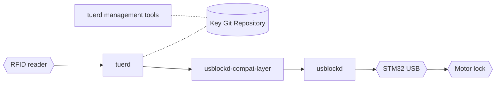

# tuerd
## General
The tuerd (Tür Daemon) is the core part of the Entropian lock system infrastructure. Its responsibility is to open the door using a motor lock if a valid token is presented to the RFID reader.


Current state of the "art":



### tuerd management tools
The tuerd management tools (deploy and read_rfid) are used to provision new keys to the lock system. The deploy application connects to a LibNFC compatible device and provisions a blank Mifare DESFire EV1 (or EV2) by setting a generated PICC master key, creating an application with AID ```0xca0523``` on the RFID token with a generated master key and a generated door key.

It returns a JSON object containing those keys (and some other fields for later use). These information need to be stored in the Key Git Repository in a file with the name ```$(UPPERCASE_UID).json```. 

### tuerd

The tuerd daemon connects to a LibNFC compatible reader and waits for a RFID token to be presented. If a Mifare DESFire EV1 (or newer) is presented to the reader, it takes the UID, checks for a corresponding JSON file in the Key Git Repository and loads it. 

Then it checks the validity of the RFID token by checking the ```active``` property and then tries to authenticate against the RFID token against our application with AID ```0xca0523``` and using the door application key in the ```ca0523_door_key``` property. If everything succeeds, it will send an open command to the usblockd-compat-layer via UNIX socket.


### usblockd-compat-layer
The usblockd-compat-layer decouples the tuerd from using signals to control the usblockd but using a (UNIX) socket and a defined command set. It is a temporary solution (ha, ha ha) to do additional stuff like controlling other motor locks not using the usblockd and it will be replaced/retired soon™️.

| Command  | Description           |
|----------|-----------------------|
| C        | Close                 |
| O        | Open                  |
| P        | Powercycle            |


### usblockd
The [usblockd](https://github.com/entropia/usblockd) daemon and firmware is responsible for controlling a motor lock using USB and a STM32. It may be replaced/rewritten in the near future.


## Compile

Dependencies:
 * openssl (>= 1.1, <3.0)
 * libnfc (>= 1.7.2)
 * libfreefare (master, tested with commit c2b0cfa4b9fb0e4be88604f00b7a2405618d5abc)